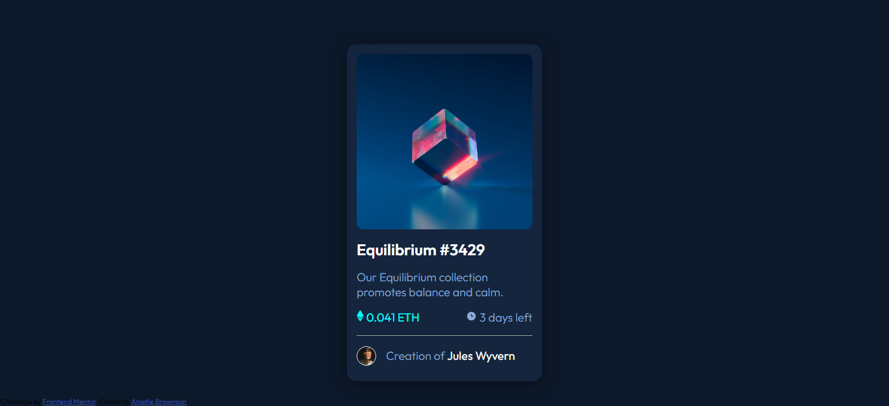

# Frontend Mentor - NFT Preview Card Component Solution

This is a solution to the [NFT preview card component challenge on Frontend Mentor](https://www.frontendmentor.io/challenges/nft-preview-card-component-SbdUL_w0U). Frontend Mentor challenges help you improve your coding skills by building realistic projects. 

## Table of contents

- [Overview](#overview)
  - [The challenge](#the-challenge)
  - [Screenshot](#screenshot)
  - [Links](#links)
- [My process](#my-process)
  - [Built with](#built-with)
  - [What I learned](#what-i-learned)
  - [Continued development](#continued-development)
  - [Useful resources](#useful-resources)
- [Author](#author)
- [Acknowledgments](#acknowledgments)


## Overview

### The challenge

Users should be able to:

- View the optimal layout depending on their device's screen size
- See hover states for interactive elements

### Screenshot




### Links

- Solution URL: [Add solution URL here](https://your-solution-url.com)
- Live Site URL: [Add live site URL here](https://your-live-site-url.com)

## My process  #################################
Project Start Time: 12:10AM    Friday 11/12/2021
Expected Date of Completion    Friday 17/12/2021

First of all started with the HTML Markup

Then I moved on to the CSS styling:
Styled the body to be mobile responsive no matter the dimension of the device's viewport. Next I styled the card and gave it the required dimensions as well as the colors.

Styled the image div and then added the images within and styled them to the required dimensions.

I had put the icon-view svg image in the div to be used as the overlay div. Thus, the icon-view svg image and the overlay div appear at the same time the mouse hovers over the image in the card.

Then I styled the other contents in the card using flex for the displayand I put a hr tag to get that dividing line in the card.

All in all, this project took me almost a week to complete and lots of things to learn.


### Built with

- Semantic HTML5 markup
- CSS custom properties
- Mobile-first workflow


### What I learned

I had to learn how to create a card to fit the display of a screen without it going out of the viewportand having to swipe right or left to see the remainder of the card.

The overlay effect was kind of hard for me and I to go online to learn how to do it with pure CSS. Youtube was really a good help although I had to cut through the endless noise to get exactly what I wanted. 

I studied the examples I saw online and I adapted and applied it to my code to get my desired effect. 

All in all, I had a great time doing this project and it made me go back to some stuff I had done in the past and recap.
Use this section to recap over some of your major learnings while working through this project. Writing these out and providing code samples of areas you want to highlight is a great way to reinforce your own knowledge.

To see how you can add code snippets, see below:

Code I'm proud of:

```css
.eye_overlay {
  position: absolute;
  top: 0;
  left: 0;
  width: 100%;
  height: 94%;
  border-radius: 10px;
  background: hsl(178, 100%, 50%);
  display: flex;
  align-items: center;
  justify-content: center;
  opacity: 0;
  transition: opacity 0.6s ease-in;
  cursor: pointer;
}


.eye_overlay:hover {
  opacity: 0.6;
}
```

It's not much but for a beginner like me, it feels great to do something and see it work.


### Continued development

I am going to improve on my CSS skills and do more of mobile responsive layouts also.
And then I'm going to work on my JavaScript skills so I can use it to implement the overlay effect without having to use CSS


### Useful resources

- [Example resource 1](https://www.w3schools.com/howto/howto_css_column_cards.asp) - This helped me when I was trying to create the card reason. It is really straightforward and easy to understand. You just have to understand how it works and then you just tweak, adapt and implement in your code.

- [Example resource 2](https://www.youtube.com/watch?v=exb2ab72Xhs) - This is video helped me understand and implement the overlay effect. His approach was so simple and straight to the point without all the fancy code and stuff. Definitely recommend it.


## Author

- Website - [Anietie Brownson](https://anietiebrownson.netlify.app)
- Frontend Mentor - [@AJBrownson](https://www.frontendmentor.io/profile/AJBrownson)
- Github - [@AJBrownson](https://github.com/AJBrownson)


## Acknowledgments

I'd like to thank everybody that also did the project also. You guys are amazing. Kudos and keep on getting better.

